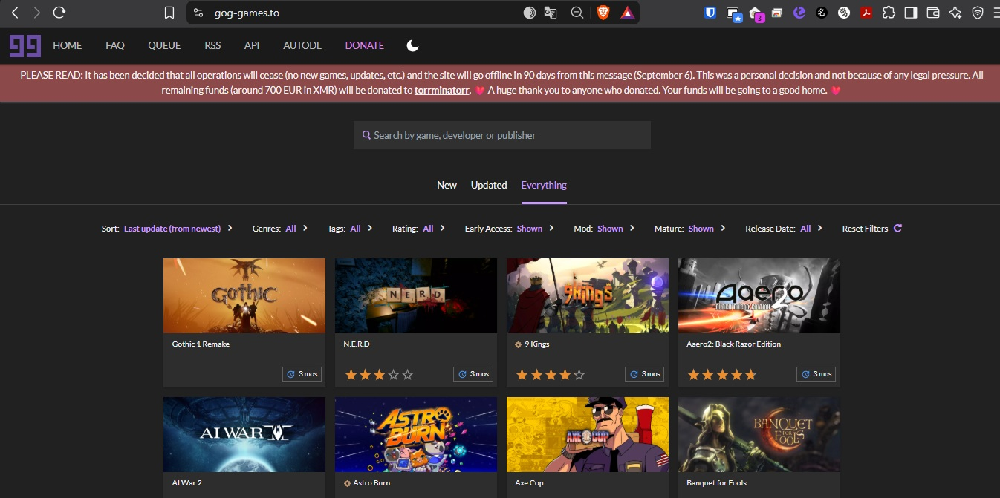
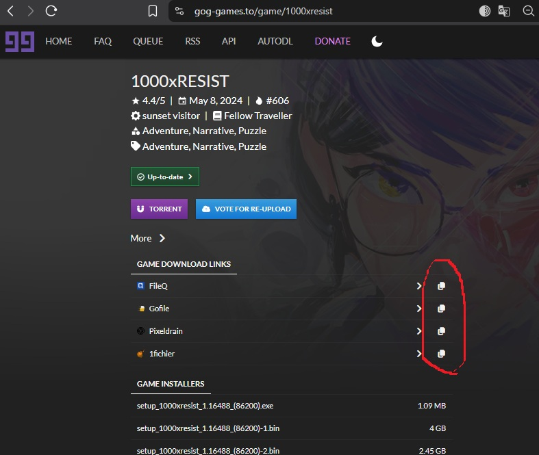

# SaveGogGames

**SaveGogGames** es un proyecto de Web Scraping desarrollado para preservar y recopilar enlaces de descarga del sitio web [gog-games.to](https://gog-games.to/), el cual cerró sus puertas el **6 de septiembre de 2026**.

Este sistema automatiza la extracción de los enlaces de más de **6,400 juegos aprox.** en el catálogo de GOG Games, resguardando los enlaces a servidores de terceros como **Gofile, fileq, pixeldrain, 1fichier**, entre otros.

## ¿Cómo funciona?

El proyecto está compuesto principalmente por un scraper escrito en TypeScript utilizando **Playwright** para la automatización del navegador.El proceso de extracción se divide en los siguientes pasos:

1. **Obtención del Listado de Juegos:**
   Realicé una petición `GET` a la API de GOG Games:
   `https://gog-games.to/api/web/all-games?select=id,slug,title`

   Esto me devolvió un listado completo con los atributos esenciales, el cual fue exportado y guardado localmente en formato JSON en:
   `scraper/listado/gog_games_list.json`

2. **Navegación y Extracción (Scraping):**
   Utilizando el `slug` abstraído en el paso anterior, **Playwright** ingresa automatizadamente a la página específica de cada uno de los más de 6,400 videojuegos.

3. **Copiado de Enlaces:**
   Dentro de la página de cada juego, el bot simula interacciones para copiar los enlaces de descarga directa hacia los distintos servidores de terceros.

   

## Rendimiento de Ejecución

Debido a la magnitud del catálogo y los tiempos de carga requeridos para no saturar los servidores, el proceso completo de recolección de los ~6,400 juegos me tomó un tiempo aproximado de **10 horas aprox.** repartidas a lo largo de **2 días** de ejecución continua.

## Estructura del Proyecto (Core)

El core del sistema se encuentra en el directorio `/scraper/`:

- `scraper/src/Scraper.ts`: Lógica principal del web scraping con Playwright.
- `scraper/listado/gog_games_list.json`: JSON generado con el listado inicial de juegos extraídos de la API.
- `scraper/links/Games_with_links.json`: Archivo resultante con los enlaces de cada juego obtenidos de los servidores de terceros.
- `scraper/img/`: Directorio de imágenes demostrativas.

## Tecnologías Utilizadas

- **Node.js**
- **TypeScript**
- **Playwright** (Automatización y Scraping)

## MUCHAS GRACIAS GOG-GAMES POR TAN BUENOS JUEGOS Y PERMITIRME JUGAR A MUCHOS DE LOS CUALES NO TUVE ACCESO EN SU MOMENTO
